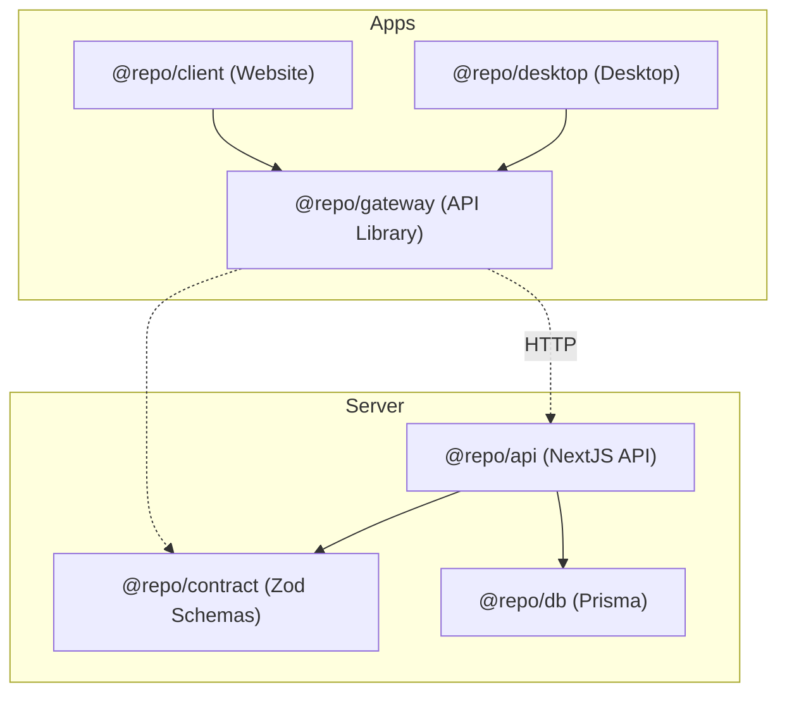

# Barbord Monorepo

## Getting Started

To get started with the Barbord Monorepo, follow these steps:

1. Install [VSCode](https://code.visualstudio.com/) and the recommended extensions. These should be prompted when you open the project, but you can also find them in `.vscode/extensions.json`.
2. Install [NodeJS](https://nodejs.org/) and [pnpm](https://pnpm.io/).
3. Set up the environment variables. You can copy the `.env.example` files in each package to `.env` and fill in the values. Do this for:
   - `@repo/api`
   - `@repo/web`
   - `@repo/db`
4. Run `pnpm install` to install the dependencies for all apps and packages.
5. Run `pnpm dev` to start the development servers for the apps.

### Work on a specific app or package

To work on a specific app or package, you can run the corresponding command:

**Database:**

- `pnpm db:generate` - Generate Prisma client for `@repo/db`
- `pnpm db:push` - Push database schema changes for `@repo/db`

**API:**

- `pnpm api:dev` - Start development server for `@repo/api`
- `pnpm api:build` - Build the production version of `@repo/api`
- `pnpm api:start` - Start the production server for `@repo/api`
- `pnpm api:generate` - Generate OpenAPI spec for `@repo/api`

**Web:**

- `pnpm web:dev` - Start development server for `@repo/web` with API proxy
- `pnpm web:build` - Build the production version of `@repo/web`
- `pnpm web:start` - Start the production server for `@repo/web`

## Apps and packages

**Apps**

- [ ] `@repo/client`: A website frontend built with `TBD`
- [ ] `@repo/desktop`: A desktop application built with Tauri
- [ ] `@repo/api`: A backend api server built with NextJS

**Packages**

- [x] `@repo/db`: A package for database access and management. This is a server side package.
- [x] `@repo/contract`: A package for shared types and validation schemas. This is a client and server side package.
- [x] `@repo/gateway`: A package for communication with the backend api. This is a client side package.

> **Currently in progress: `@repo/api`:**
>
> - Product Order History
> - Product Stock History
>
> The entire progress is in [TODO.md](./TODO.md)

**Relationships**

