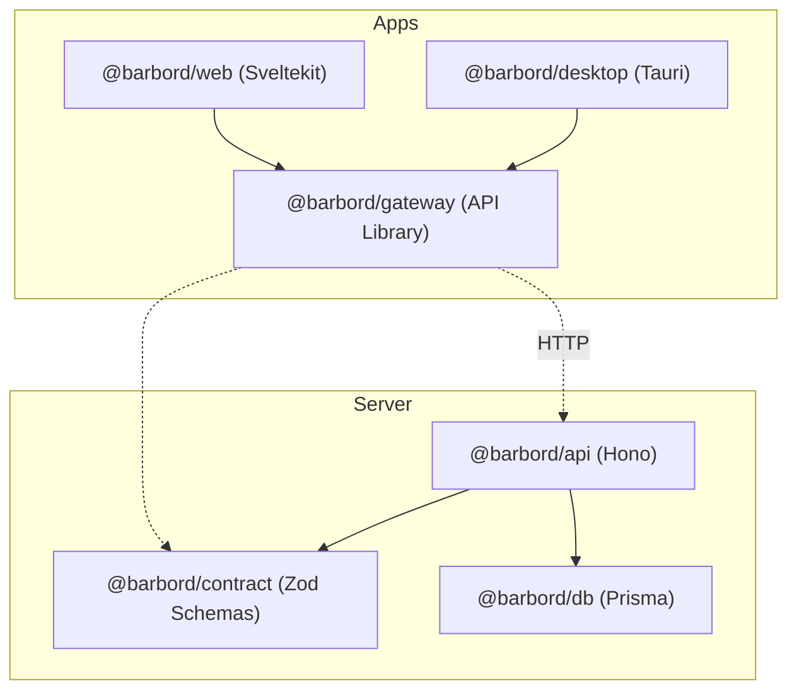

# Barbord Monorepo

## Apps and packages

**Apps**

- [ ] `@barbord/web`: A website frontend built with Sveltekit
- [x] `@barbord/desktop`: A Tauri wrapper for `@barbord/web`
- [x] `@barbord/api`: A backend api server built with Hono

**Packages**

- [x] `@barbord/db`: A package for database access and management. This is a server side package.
- [x] `@barbord/contract`: A package for shared types and validation schemas. This is a client and server side package.
- [x] `@barbord/gateway`: A package for communication with the backend api. This is a client side package.

> **Currently in progress: `@barbord/web`:**

**Relationships**

## Getting started

### General setup

To get started with the Barbord Monorepo, follow these steps:

1. Install [VSCode](https://code.visualstudio.com/) and the recommended extensions. These should be prompted when you open the project, but you can also find them in `.vscode/extensions.json`.
2. Install [NodeJS](https://nodejs.org/) and [pnpm](https://pnpm.io/).
3. Set up the environment variables by creating mode-specific env files. Copy each `.env.example` and create:
   - `.env.development` for local development values
   - `.env.production` for production build/runtime values
     These are used automatically by the scripts (`dev` uses development, `build` uses production).
     Do this for:
   - `@barbord/api`
   - `@barbord/web`
   - `@barbord/db`
4. Run `pnpm install` to install the dependencies for all apps and packages.
5. Run `pnpm dev` to start the development servers for the apps.

### Work on a specific app or package

To work on a specific app or package, you can run the corresponding command:

**Database:**

- `pnpm db:generate` - Generate Prisma client for `@barbord/db`
- `pnpm db:push` - Push database schema changes for `@barbord/db`

**API:**

- `pnpm api:dev` - Start development server for `@barbord/api`
- `pnpm api:build` - Build the production version of `@barbord/api`
- `pnpm api:start` - Start the production server for `@barbord/api`

**Web:**

- `pnpm web:dev` - Start development server for `@barbord/web` with API proxy
- `pnpm web:build` - Build the production version of `@barbord/web`
- `pnpm web:start` - Start the production server for `@barbord/web`

### Build order

Running `pnpm build` will build all apps and packages with turborepo. Everything is configured to run in the following order:

1. Packages
   - `@barbord/contract`
   - `@barbord/db`
   - `@barbord/gateway`
2. Apps
   - `@barbord/api`
   - `@barbord/web`
3. Desktop
   - `@barbord/desktop`

### Resetting the repository

You can reset the repo with `./reset.ps1` on Windows. This removes:

- `node_modules` for all
- `.turbo` for all
- `dist` for all
- `target` for @barbord/desktop